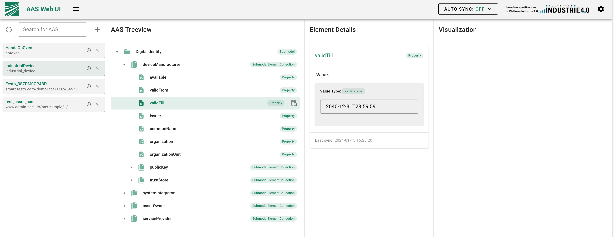

# aas_x509

Deploying the BaSyx AAS GUI, BaSyx AAS registry and AAS server via Docker Compose and the create an Asset Administration Shell (AAS) and a submodel via the BaSyx Python SDK.

## Deploy BaSyx via Docker Compose

This Docker Compose configuration sets up a deployment of Eclipse BaSyx components, including the BaSyx AAS (Asset Administration Shell) registry, AAS server, and a GUI. Follow the steps below to deploy the system.

> The AAS server wil be deployed in version 2.0

### Prerequisites

Make sure you have Docker and Docker Compose installed on your machine.

### Startup

Go to docker
```bash
cd docker
```

Start docker-compose
```bash
docker-compose up -d
```

* Access the BaSyx AAS GUI by navigating to http://localhost:3000 in your web browser.
* The BaSyx AAS registry is accessible at http://localhost:4000/registry.
* The AAS server is accessible at http://localhost:4001/aasServer.

# Generate a AAS and a submodel

To create a submodel one need to create an Asset Administration Shell (AAS) and afterwards a submodel  for the AAS.

> The Basyx Python SDK is for the AAS server API version 3.0. The json to create the submodel will be manipulated

## Prerequisites

Install requirements
```bash
pip install -r requirements.txt
```

## Create an Asset Administration Shell (AAS)

This Python script facilitates the creation of an Asset Administration Shell (AAS) on a BaSyx AAS server. The script uses the requests library to send a PUT request to the specified BaSyx AAS server URL, providing a JSON payload for AAS creation.

``` bash
python ./src/create_aas.py
```

## Create a submodel

This script is designed to update an Asset Administration Shell (AAS) submodel using the Eclipse BaSyx framework. The script takes a JSON template file and assembles an AAS submodel, which is then updated on a BaSyx AAS server.

The template includes information about different roles involved in the system, such as device manufacturer, system integrator, asset owner, and service provider. Each role has associated attributes specifying availability, validity period, issuer details, common name, organization, organization unit, public key, and trust store.

### Usage

* Create a JSON template file (./src/template.json) that follows the structure expected by the script. The template should contain entities and their properties.
* Customize the script variables in the __main__ block at the end of the script:
  * **submodel_id**: Identifier for the AAS submodel.
  * **json_template**: Path to the JSON template file.
  * **device_id**: Identifier for the industrial device.

``` bash
python ./src/create_submodel.py
```

After the creation of a submodell it will be visible in the WebUI (http://localhost:3000)

